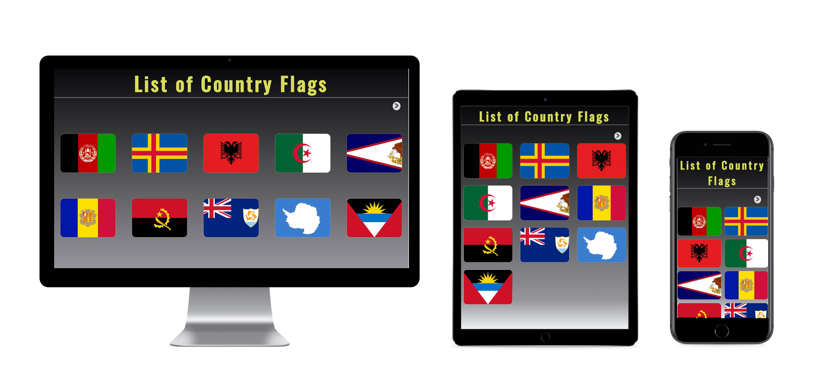

# Forbes Engineering Coding Test

## Features

- [x] API: List of data about countries  https://restcountries.eu/rest/v2/all
- [x] 10 thumbnails per page.
- [x] Clicking on an image will enlarge it in the modal.
- [x] All images belong to a specific country.

## Technical 
- Language: Built using HTML, CSS and JS
- IDE: Vitual Studio.
- Only used vanilla JS (no frameworks, or libraries).
- Works smoothly in both mobile and desktop (Responsive Design).
- Executing following command will run the website at http://localhost:8125/
    - `npm i && npm start` from its root directory

# Extra feature
- Heading color changes on each reload.
  
# Screenshot

